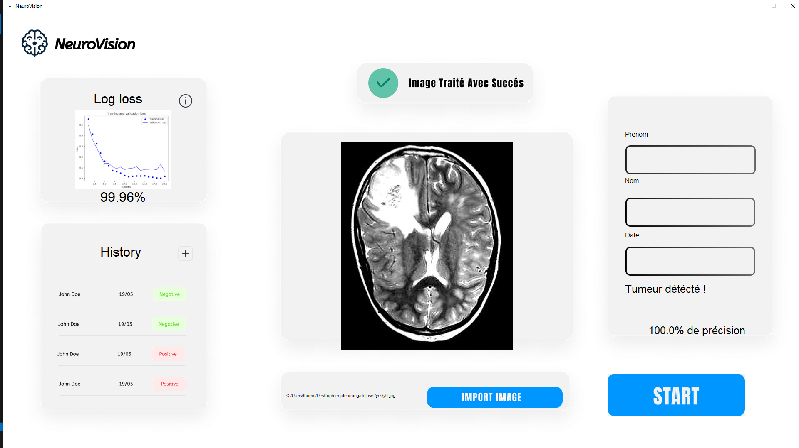

# NeuroVision (Anciennement MedAi)

## Description

NeuroVision est un projet utilisant le Deep Learning pour détecter les tumeurs cérébrales à partir d'images médicales. Une interface graphique intuitive a été développée pour faciliter l'interaction avec le modèle de détection. Actuellement, l'historique des détections et la base de données ne sont pas encore fonctionnels.

## Exemple



## Fonctionnalités

- Détection des tumeurs cérébrales à partir d'images médicales.
- Interface graphique intuitive pour charger et analyser les images.
- Affichage des résultats de détection directement dans l'interface graphique.

## Fonctionnalités futures

- Ajout d'une base de données. (La base de données présente dans l'exemple ne fonctionne pas).

## État du projet

- La détection des tumeurs fonctionne correctement.
- L'interface n'est qu'à moitié responsive et fonctionne correctement (elle fonctionne parfaitement sur un écran 1920x1080).
- Les fonctionnalités d'historique et de base de données ne sont pas encore implémentées.

## Prérequis

- Python 3.6 ou supérieur
- TensorFlow
- Keras
- Pillow
- OpenCV
- Tkinter
- cv2

Tous les modules sont présents dans le fichier `requirements.txt`.

## Choix du nombre d'époques en fonction du LL

Nous avons choisi un nombre d'époques situé entre 8 et 12 afin d'éviter tout underfitting ou overfitting.


## Installation

1. Installer les modules :
   ```bash
   pip install -r requirements.txt
   ```

## Utilisation

```bash
python main.py
```

## Contribution

Les contributions sont les bienvenues ! Veuillez créer une pull request ou ouvrir une issue pour discuter des changements que vous souhaitez apporter.
